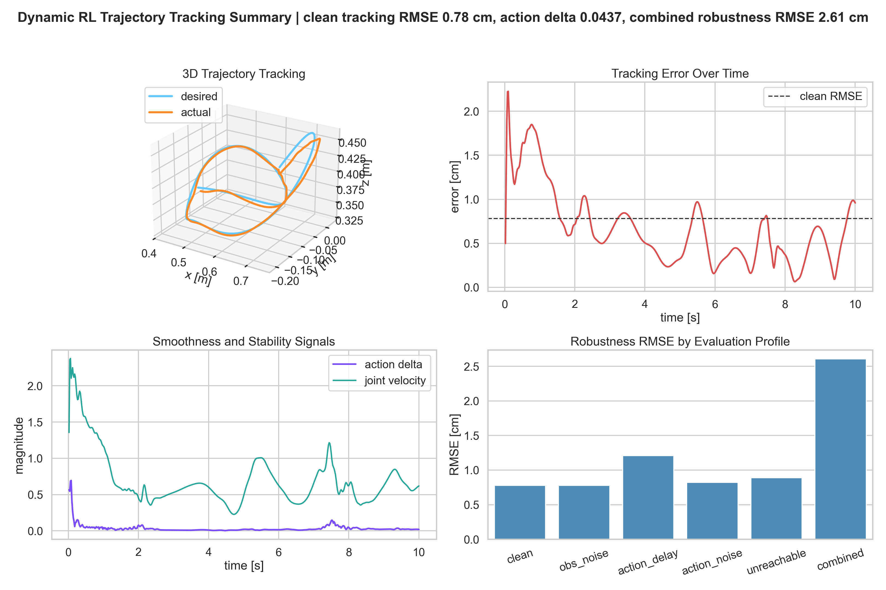
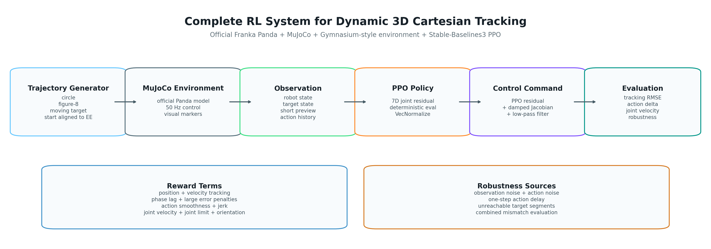

# MuJoCo PPO Dynamic 3D Trajectory Tracking
**Author:** Taiyi Zhao

**Submission:** Humanoid - 3D End-Effector Tracking

This project is a complete MuJoCo reinforcement-learning system for dynamic
3D Cartesian trajectory tracking with the official MuJoCo Menagerie Franka
Panda robot. The policy is trained with Stable-Baselines3 PPO. 


The task is continuous tracking of a moving target:

```text
p_desired = p_desired(t)
```

This is not a pure inverse-kinematics tracker. The Jacobian term is a small stabilizing prior, while PPO remains responsible for the residual joint command, action smoothing, delay/noise robustness, and target-mismatch behavior.

## Demo Video

The demo video shows the trained policy tracking a dynamic target trajectory
in MuJoCo.

[Watch the demo video](demo.mp4)

## Results Overview



## System Design


## Quick Start

These commands are the shortest path to verify the submitted project on a new
machine.

Prerequisite: Python 3.11 is required. Install it from
https://www.python.org/downloads/ or use Conda to create a Python 3.11
environment.

Conda environment, Windows/macOS/Linux:

```bash
cd <project-folder>
conda create -n trajec_mujoco python=3.11 -y
conda activate trajec_mujoco
python -m pip install --upgrade pip
pip install -r requirements.txt
```

If Conda is not available, use Python `venv`:

Windows PowerShell:

```powershell
cd <project-folder>
py -3.11 -m venv .venv
Set-ExecutionPolicy -Scope Process -ExecutionPolicy Bypass
.\.venv\Scripts\Activate.ps1
python -m pip install --upgrade pip
pip install -r requirements.txt
```

macOS/Linux:

```bash
cd <project-folder>
python3.11 -m venv .venv
source .venv/bin/activate
python -m pip install --upgrade pip
pip install -r requirements.txt
```

Quick verification on Windows PowerShell:

```powershell
python scripts\smoke_test.py

$RUN = "results\runs\panda_ppo_trajectory_tracker"
$MODEL = Join-Path $RUN "models\selected_model.zip"
$VECNORM = Join-Path $RUN "models\selected_vecnormalize.pkl"

python scripts\viewer.py `
  --run-dir $RUN `
  --model $MODEL `
  --vecnormalize $VECNORM `
  --trajectory-type figure8
```

Quick verification on macOS/Linux:

```bash
python scripts/smoke_test.py

RUN="results/runs/panda_ppo_trajectory_tracker"
MODEL="$RUN/models/selected_model.zip"
VECNORM="$RUN/models/selected_vecnormalize.pkl"

python scripts/viewer.py \
  --run-dir "$RUN" \
  --model "$MODEL" \
  --vecnormalize "$VECNORM" \
  --trajectory-type figure8
```

Replace `figure8` with `circle` or `moving` to view another target trajectory.

## Submitted Files

- Selected run: `results/runs/panda_ppo_trajectory_tracker`
- Policy: `results/runs/panda_ppo_trajectory_tracker/models/selected_model.zip`
- Normalization stats: `results/runs/panda_ppo_trajectory_tracker/models/selected_vecnormalize.pkl`
- Demo video: `demo.mp4`
- Overview: `overview.png`
- System design: `system_design.png`
- PDF summary: `README.pdf`

## Headline Results

| evaluation | RMSE | success rate |
|---|---:|---:|
| clean mixed trajectory evaluation | 0.78 cm | 100.00% |
| combined robustness evaluation | 2.61 cm | 92.60% |
| fixed circle / figure8 / moving average | 0.71 cm | 100.00% |

The clean mixed result is produced by the default `clean` profile in
`scripts/evaluate.py`. The fixed trajectory result is the aggregate of separate
`circle`, `figure8`, and `moving` evaluations.

## Installation Details

Use Python 3.11. The provided `requirements.txt` installs the MuJoCo, PPO,
plotting, and video dependencies without pinning a CUDA-specific PyTorch wheel.

```powershell
cd <project-folder>
conda create -n trajec_mujoco python=3.11 -y
conda activate trajec_mujoco
python -m pip install --upgrade pip
pip install -r requirements.txt
```

Optional CPU-only PyTorch install:

```powershell
pip install torch --index-url https://download.pytorch.org/whl/cpu
pip install -r requirements.txt
```

Optional GPU note: PyTorch CUDA wheels bundle the CUDA runtime libraries needed
by PyTorch. A separate CUDA Toolkit install is not required for this project,
but a compatible NVIDIA driver is required. If a GPU wheel is desired, install
PyTorch from the official PyTorch selector before `pip install -r
requirements.txt`.

Check the selected PyTorch device:

```powershell
python -c "import torch; print(torch.__version__); print('cuda_available =', torch.cuda.is_available())"
```

Quick environment checks:

```powershell
python scripts\smoke_test.py
python scripts\smoke_test.py --render
```

The render check writes:

```text
results/smoke_frame.png
```

## Evaluate the Final Policy

Run the default final evaluation. This evaluates all robustness profiles listed
in `configs/balanced_smooth_finetune.yaml`.

```powershell
$RUN = "results\runs\panda_ppo_trajectory_tracker"
$MODEL = Join-Path $RUN "models\selected_model.zip"
$VECNORM = Join-Path $RUN "models\selected_vecnormalize.pkl"
$EVAL_DIR = Join-Path $RUN "evaluation"

python scripts\evaluate.py `
  --run-dir $RUN `
  --model $MODEL `
  --vecnormalize $VECNORM `
  --out-dir $EVAL_DIR
```

Run fixed trajectory-family evaluations:

```powershell
$RUN = "results\runs\panda_ppo_trajectory_tracker"
$MODEL = Join-Path $RUN "models\selected_model.zip"
$VECNORM = Join-Path $RUN "models\selected_vecnormalize.pkl"

python scripts\evaluate.py `
  --run-dir $RUN `
  --model $MODEL `
  --vecnormalize $VECNORM `
  --trajectory-type circle `
  --out-dir (Join-Path $RUN "evaluation_circle")

python scripts\evaluate.py `
  --run-dir $RUN `
  --model $MODEL `
  --vecnormalize $VECNORM `
  --trajectory-type figure8 `
  --out-dir (Join-Path $RUN "evaluation_figure8")

python scripts\evaluate.py `
  --run-dir $RUN `
  --model $MODEL `
  --vecnormalize $VECNORM `
  --trajectory-type moving `
  --out-dir (Join-Path $RUN "evaluation_moving")
```

Each evaluation writes:

```text
summary.csv
tracking_log.csv
plots/desired_vs_actual_3d.png
plots/tracking_error_over_time.png
plots/action_smoothness_over_time.png
plots/joint_velocity_over_time.png
plots/robustness_rmse_summary.png
```

## Render Videos

Generate 20 second MuJoCo videos for the three trajectory families:

```powershell
$RUN = "results\runs\panda_ppo_trajectory_tracker"
$MODEL = Join-Path $RUN "models\selected_model.zip"
$VECNORM = Join-Path $RUN "models\selected_vecnormalize.pkl"

python scripts\render_video.py `
  --run-dir $RUN `
  --model $MODEL `
  --vecnormalize $VECNORM `
  --seconds 20 `
  --trajectory-type circle `
  --out (Join-Path $RUN "videos\tracking_circle_20s.mp4")

python scripts\render_video.py `
  --run-dir $RUN `
  --model $MODEL `
  --vecnormalize $VECNORM `
  --seconds 20 `
  --trajectory-type figure8 `
  --out (Join-Path $RUN "videos\tracking_figure8_20s.mp4")

python scripts\render_video.py `
  --run-dir $RUN `
  --model $MODEL `
  --vecnormalize $VECNORM `
  --seconds 20 `
  --trajectory-type moving `
  --out (Join-Path $RUN "videos\tracking_moving_20s.mp4")
```

Generate the final presentation package:

```powershell
$RUN = "results\runs\panda_ppo_trajectory_tracker"

python scripts\make_final_artifacts.py `
  --run-dir $RUN `
  --out-dir . `
  --eval-dir-name evaluation
```

Open an interactive MuJoCo viewer:

```powershell
$RUN = "results\runs\panda_ppo_trajectory_tracker"
$MODEL = Join-Path $RUN "models\selected_model.zip"
$VECNORM = Join-Path $RUN "models\selected_vecnormalize.pkl"

python scripts\viewer.py `
  --run-dir $RUN `
  --model $MODEL `
  --vecnormalize $VECNORM `
  --trajectory-type circle
```

Replace `circle` with `figure8` or `moving` to view another target family.

## Training

Train a new PPO policy:

```powershell
python scripts\train.py --config configs\balanced_smooth_finetune.yaml --timesteps 2000000 --run-name my_panda_tracker --n-envs 4 --device auto
```

Resume from an existing run:

```powershell
$RUN = "results\runs\panda_ppo_trajectory_tracker"
$MODEL = Join-Path $RUN "models\selected_model.zip"
$VECNORM = Join-Path $RUN "models\selected_vecnormalize.pkl"

python scripts\train.py `
  --config configs\balanced_smooth_finetune.yaml `
  --resume-run-dir $RUN `
  --resume-model $MODEL `
  --resume-vecnormalize $VECNORM `
  --timesteps 1000000 `
  --learning-rate 0.00003 `
  --run-name continued_tracker `
  --n-envs 4 `
  --device auto
```

The submitted policy was trained in staged PPO runs. The final selected model
is at about 6.91M total environment steps:

| stage | total steps used for selected policy |
|---|---:|
| initial gripper-down training | about 0.50M |
| tight tracking checkpoint selection | 2.21M |
| smooth tracking policy | 4.91M |
| final aligned-start continuation | 6.91M |

Training is not required to reproduce the submitted results because the final
model and normalization statistics are included.

## Environment Design

Robot and simulator:

- Robot: official MuJoCo Menagerie Franka Panda.
- Scene wrapper: `assets/mujoco_menagerie/franka_emika_panda/tracking_scene.xml`.
- Control rate: 50 Hz by default.
- End-effector site: Panda `gripper`.
- Action space: normalized 7D joint residual action.

The control command combines the learned PPO action with a small damped
Jacobian Cartesian tracking prior:

```text
q_target[t+1] =
    q_target[t]
  + PPO_joint_residual
  + damped_Jacobian_tracking_prior
```

The Jacobian term is a kinematic prior. PPO remains the learned controller.

## State, Action, and Reward

Observation contains:

- 7 joint positions
- 7 joint velocities
- end-effector position and velocity
- current desired Cartesian position and velocity
- short-horizon desired position preview
- current Cartesian tracking error
- fixed-reference orientation error
- episode phase encoded as `sin/cos`
- previous applied action

Action:

- 7D normalized joint residual from PPO.
- The action is scaled, filtered, optionally delayed, and applied through
  MuJoCo joint position actuators.

Reward:

```text
reward =
    w_pos * exp(-alpha * ||p_ee - p_des||^2)
  + w_vel * exp(-beta * ||v_ee - v_des||^2)
  - w_pos_err * ||p_ee - p_des||
  - w_lag * phase_lag
  - w_action * ||a_t||^2
  - w_smooth * ||a_t - a_{t-1}||^2
  - w_jerk * ||a_t - 2a_{t-1} + a_{t-2}||^2
  - w_qvel * ||q_dot||^2
  - w_limit * joint_limit_penalty
  - w_ori * orientation_error
  - w_large * large_error_penalty
```

Final reward weights:

| term | weight |
|---|---:|
| position | 4.0 |
| velocity tracking | 0.85 |
| position error | 1.50 |
| phase lag | 1.25 |
| action magnitude | 0.010 |
| action smoothness | 0.120 |
| action jerk | 0.060 |
| joint velocity | 0.0060 |
| joint limit | 0.070 |
| orientation | 0.24 |
| large error | 5.0 |

The orientation term is a soft fixed-reference objective:

```text
desired_orientation(t) = gripper_down
```

It encourages a stable downward-facing gripper while position tracking remains
the main task.

## Target Trajectories

Trajectory generation is implemented in:

```text
trajec_mujoco/trajectories/generator.py
```

Supported target families:

- `circle`: smooth closed 3D ellipse.
- `figure8`: crossing Lissajous-style path.
- `moving`: non-closed moving target with coupled oscillations.

Each trajectory provides both desired position and desired velocity:

```text
(p_desired(t), v_desired(t))
```

During training, trajectory type, phase, scale, frequency, and center are
randomized. At reset, the trajectory is translated so that `p_desired(0)` equals
the current end-effector position. This removes an artificial initial jump but
keeps the trajectory shape, phase, and velocity profile unchanged.

Visualization in MuJoCo:

- pale blue: full reference trajectory
- green: target trajectory generated up to the current time
- orange: actual end-effector trajectory

## Uncertainty Design

The environment includes the required uncertainty sources and one extra source.

Training defaults:

| source | config |
|---|---:|
| observation noise | `observation_noise_std = 0.003` |
| action noise | `action_noise_std = 0.015` |
| action delay | `action_delay_steps = 1` |
| unreachable targets | `unreachable_prob = 0.10` |

Evaluation profiles:

| profile | conditions |
|---|---|
| `clean` | no observation noise, no action noise, no delay, no unreachable targets |
| `obs_noise` | observation noise std at least `0.006` |
| `action_delay` | action delay at least `2` control steps |
| `action_noise` | action noise std at least `0.030` |
| `unreachable` | unreachable target probability `1.0` |
| `combined` | randomized trajectories, observation noise, action noise, delay, and unreachable probability `0.35` |

Unreachable target episodes shift the target farther from the nominal workspace
and enlarge the trajectory. This tests behavior under target mismatch rather
than only ideal reachable tracking.

## Evaluation Metrics

Per-step tracking error:

```text
e_t = ||p_ee(t) - p_desired(t)||
```

Reported metrics:

- mean tracking error: average of `e_t`.
- RMSE tracking error: `sqrt(mean(e_t^2))`.
- maximum tracking error: largest `e_t`.
- action delta: mean norm of `a_t - a_{t-1}`.
- joint velocity magnitude: mean norm of `q_dot`.
- success rate: fraction of time steps with `e_t < 0.055 m`.

The headline clean RMSE is computed by `scripts/evaluate.py` on the final
default `clean` profile using the configured `mixed` trajectory sampler. Fixed
trajectory-family evaluations are also reported separately for `circle`,
`figure8`, and `moving`.

## Final Results

Main robustness evaluation:

| profile | mean error (cm) | RMSE (cm) | max error (cm) | action delta | joint velocity | success rate |
|---|---:|---:|---:|---:|---:|---:|
| clean | 0.67 | 0.78 | 2.37 | 0.0437 | 0.6861 | 100.00% |
| obs_noise | 0.68 | 0.78 | 2.37 | 0.1863 | 0.7133 | 100.00% |
| action_delay | 1.05 | 1.21 | 3.84 | 0.2431 | 0.9766 | 100.00% |
| action_noise | 0.71 | 0.82 | 2.45 | 0.1208 | 0.7056 | 100.00% |
| unreachable | 0.78 | 0.89 | 2.38 | 0.0391 | 0.7854 | 100.00% |
| combined | 1.84 | 2.61 | 10.31 | 0.2668 | 1.0756 | 92.60% |

Fixed clean trajectory-family evaluation:

| trajectory | mean error (cm) | RMSE (cm) | max error (cm) | success rate |
|---|---:|---:|---:|---:|
| circle | 0.57 | 0.64 | 2.06 | 100.00% |
| figure8 | 0.66 | 0.76 | 1.97 | 100.00% |
| moving | 0.65 | 0.74 | 2.37 | 100.00% |
| all three fixed families | 0.63 | 0.71 | 2.37 | 100.00% |

These centimeter-level values are dynamic RL tracking errors for a moving
target. They are not industrial fixed-point repeatability specifications.

## Project Structure

```text
assets/
  mujoco_menagerie/franka_emika_panda/
configs/
  default.yaml
  balanced_smooth_finetune.yaml
scripts/
  train.py
  evaluate.py
  render_video.py
  viewer.py
  make_final_artifacts.py
trajec_mujoco/
  envs/
  trajectories/
  utils/
results/
  runs/panda_ppo_trajectory_tracker/
demo.mp4
overview.png
system_design.png
requirements.txt
README.md
```

## Submission Folder

The prepared `submission/` folder contains the runnable code, official Panda
assets, configuration files, final selected model, evaluation CSVs/plots,
videos, and final presentation images.

Use `submission/` as the project root on a new machine and run the same
installation, evaluation, rendering, and viewer commands from that folder.
